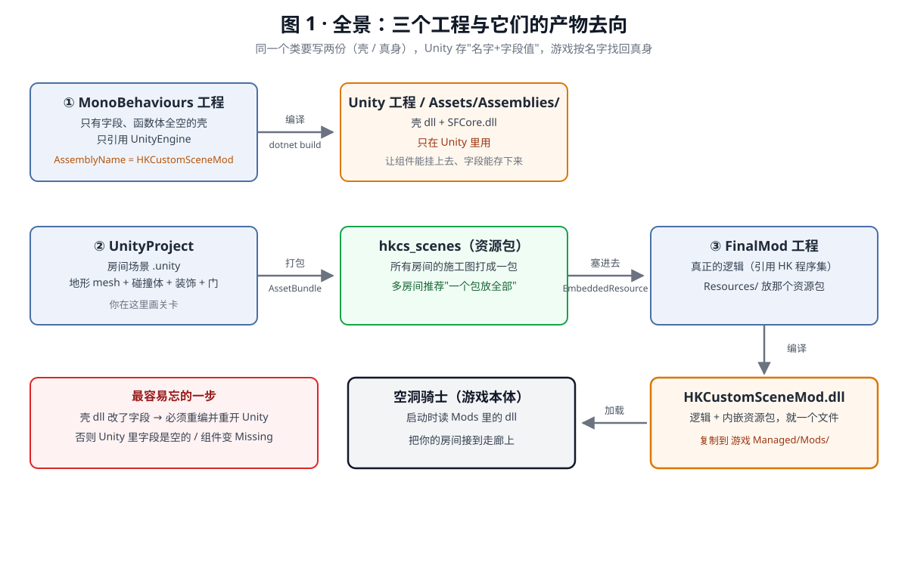
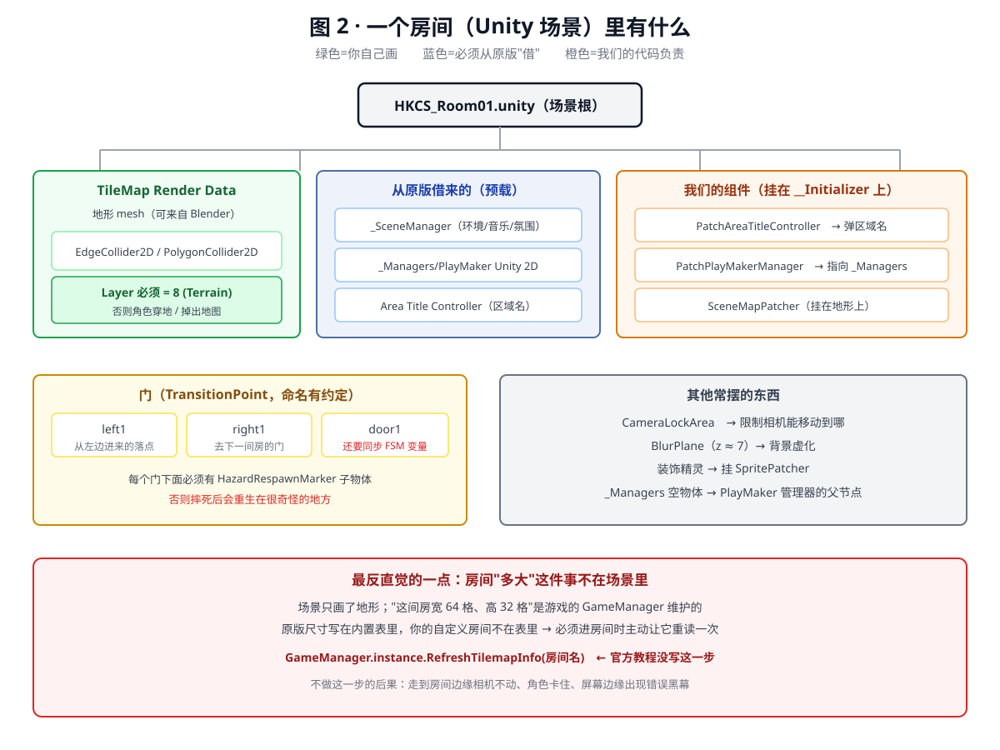
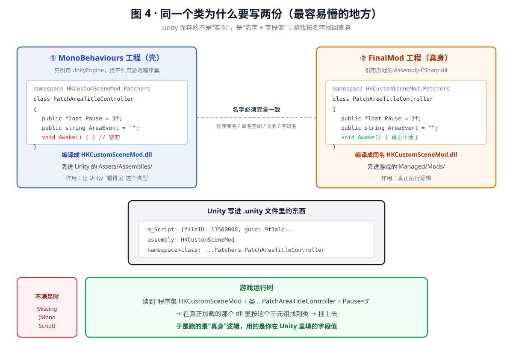
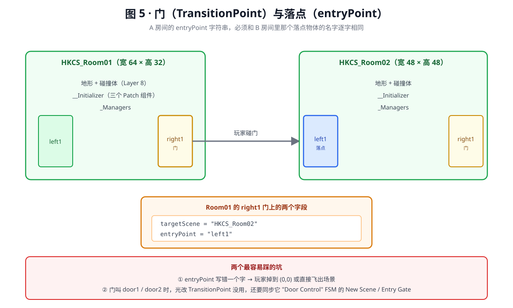
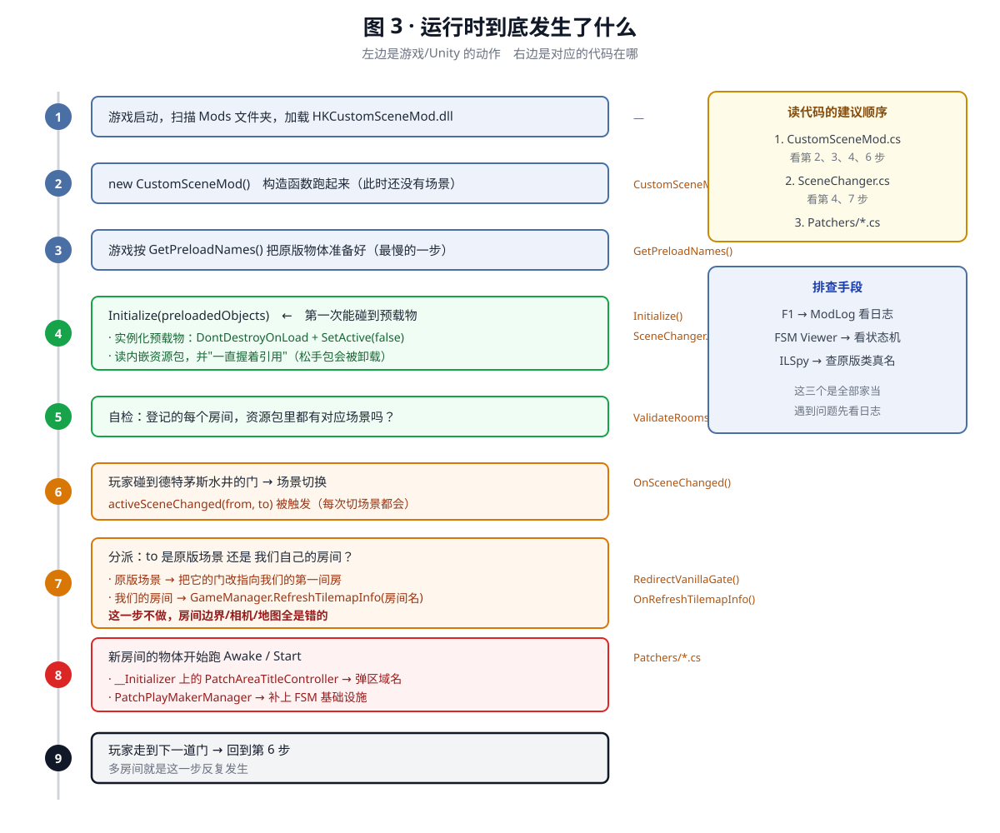
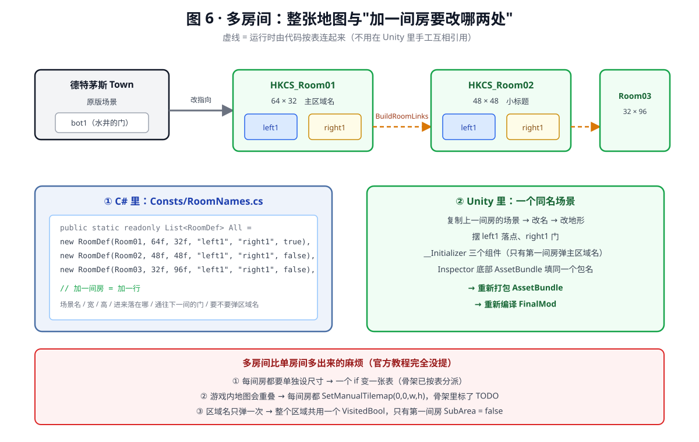

# 从零理解：空洞骑士自定义场景 Mod（多房间）

> 这份文档假设你**完全不懂** Unity、不懂 AssetBundle、不懂 C# 编译。  
> 目标不是让你马上会写，而是让你看完能回答三个问题：  
> **① 这东西为什么非得这么做　② 每一步在干嘛　③ 出错了该往哪看。**
>
> 配套代码：`FinalMod/`、`MonoBehaviours/`、`UnityProject/`  
> 配图：`图/` 目录下 6 张 SVG（矢量图，任意放大都清晰）  
> 官方文档：<https://prashantmohta.github.io/ModdingDocs/new-scene.html>

> **关于配图**：图是**手写的 SVG**，不是图像生成模型画的。  
> 技术图不能用生成式图片——它会把框里的文字画错，而这里的每一个标签都是要照着做的。  
> 用 VS Code / Typora / 浏览器打开 `.md` 就能看到图；看不到就直接打开 `图/fig*.svg`。

---

## 目录

| 章  | 内容         | 配图                           |
| -- | ---------- | ---------------------------- |
| 0  | 最终要做出什么    | 图 1                          |
| 1  | 心智模型：翻译成人话 | —                            |
| 2  | "房间"到底是什么  | [图 2](图/fig2-room-scene.svg) |
| 3  | 为什么是三个工程   | [图 4](图/fig4-two-dlls.svg)   |
| 4  | 六个核心概念     | [图 5](图/fig5-gates.svg)      |
| 5  | 运行时到底发生了什么 | [图 3](图/fig3-runtime.svg)    |
| 6  | 从零跑通的最小路径  | —                            |
| 7  | 多房间的特殊之处   | [图 6](图/fig6-multiroom.svg)  |
| 8  | 故障对照表      | —                            |
| 9  | 术语中英对照     | —                            |
| 10 | 骨架文件清单     | —                            |
| 附  | 官方文档没说清的地方 | —                            |

---

## 第 0 章 · 先看全貌：你最终要做出什么

你要做的是一个 **`.dll` 文件**。把它丢进游戏目录，游戏启动时会读它。  
装了它以后，游戏里会多出**几个原版不存在的房间**，从德特茅斯的水井下去就能进。

就这么多。但中间隔着一整套工程学——原因见 [图 1](图/fig1-overview.svg)。



**看图要点（按箭头走一遍）**：

1. **① 壳工程**编译出的 dll 只进 Unity，**不进游戏**。它的唯一作用是让 Unity"看得见"你的组件类型。
2. **② Unity 工程**里的房间场景，打包成 **AssetBundle**（一个压缩包）。
3. 这个包被**塞进 ③ FinalMod 工程的 Resources/**，作为"内嵌资源"编译进 dll。
4. **③ FinalMod** 编译出一个 dll，里面**同时装着逻辑和资源包**——所以发布只有一个文件。
5. 游戏启动时读这个 dll，于是新房间能接上去。

> 图右下角那个红框是本流程**最容易忘**的一步：  
> 改了壳 dll 的字段（哪怕只是加一个 `public string`），必须重编壳 dll **并且重开 Unity**，  
> 否则 Unity 里字段是空的、或者组件直接变成 `Missing (Mono Script)`。

---

## 第 1 章 · 心智模型：先把这件事翻译成人话

| 游戏里的东西                               | 人话类比                               |
| ------------------------------------ | ---------------------------------- |
| **空洞骑士本体**                           | 一栋已经盖好、装修好的大楼                      |
| **一个房间**（比如"德特茅斯"）                   | 楼里的一间房                             |
| **`SceneManager.LoadScene("Town")`** | 推门进"德特茅斯"这间房                       |
| **Unity**                            | 装修设计软件，原版那些房间就是用它设计的               |
| **Unity 场景文件（`.unity`）**             | 一间房的**施工图**（家具摆哪、地面在哪、门在哪）         |
| **AssetBundle**                      | 把一堆施工图打包成的**一个压缩包**                |
| **你的 Mod**                           | 一个工人：**拆包**，然后把新房间接到原有走廊上          |
| **Preload（预载）**                      | 原版的家具没画在你图纸里，只能**从原版房间里"借"出来**复制一份 |
| **Hook（钩子）**                         | 在原版代码要执行某动作时**插一脚**，改成你想要的行为       |

**整个玩法的核心矛盾**：  
你不能"用代码造一个房间"——那样得手写每一个像素、每一个碰撞体。  
你必须**用 Unity 画出房间**，但 Unity 画出来的东西游戏本体不认识，  
所以你需要一个"翻译层"（Mod）把它接进去。**这就是为什么会有三个工程。**

---

## 第 2 章 · 空洞骑士的"房间"到底是什么

### 2.1 一个房间 = 一个 Unity Scene

空洞骑士全游戏约 400 个"房间"，每个房间对应一个 Unity 场景文件。  
你从德特茅斯走进十字路，游戏做的事就是：

```
玩家碰到门 → 门上的组件说"我要去 Crossroads_01，从 top1 进"
           → 游戏调用 SceneManager.LoadScene("Crossroads_01")
           → Unity 卸载旧场景、加载新场景
           → 新场景里的组件跑 Awake/Start，房间"活"过来
```

**关键结论**：所谓"制作自己的场景"，就是**做出一个游戏能这样加载的场景**。

### 2.2 一个房间文件里到底存了什么



**看图要点**（三种颜色对应三种来源）：

- 🟢 **绿色 = 你自己画**：地形 mesh、碰撞体、装饰、门。这是关卡设计的本体。
- 🔵 **蓝色 = 必须从原版"借"（预载）**：`_SceneManager`、`PlayMaker Unity 2D`、`Area Title Controller`。  
  它们是游戏逻辑的载体，你在 Unity 里造不出可用的版本。
- 🟠 **橙色 = 我们的代码负责**：挂在 `__Initializer` 上的三个 Patch 组件。

还有两个必须记住的点：

- **每一个门下面都必须有 `HazardRespawnMarker` 子物体**，否则玩家摔死后会重生在很奇怪的地方。
- **地形必须在 Layer 8 (Terrain)**，否则角色会穿地、掉出地图。

### 2.3 房间"多大"这件事**不在场景里**

这是全篇最反直觉的一点，图 2 底部专门标出来了：

> 场景只画了地形；"这间房宽 64 格、高 32 格"是**游戏的 `GameManager` 维护的**。  
> 原版尺寸写在内置表里，**你的自定义房间不在表里** → 必须进房间时主动让它重读一次。

```csharp
GameManager.instance.RefreshTilemapInfo(房间名);
```

**不做这一步的后果**：走到房间边缘时相机不动、角色卡住、屏幕边缘出现错误的黑幕、地图显示错误。

---

## 第 3 章 · 为什么是三个工程（最容易懵的地方）



### 3.1 先看矛盾

- Unity 需要"看得见"你的组件类型，才能把组件挂到物体上、把字段值存进 `.unity`。
- 但 Unity **不能引用游戏自己的程序集**（`Assembly-CSharp.dll`）——引用了 Unity 加载时会炸。
- 而你的组件逻辑（比如"把预载的 Area Title Controller 实例化出来"）必须访问游戏类型。

**结论：同一个类，要写两份。** 看图 4 左右两栏——代码几乎一模一样，区别只有两点：

|           | ① 壳工程（左）                     | ② FinalMod（右）        |
| --------- | ---------------------------- | -------------------- |
| 引用        | 只有 UnityEngine               | 有游戏的 Assembly-CSharp |
| `Awake()` | **空的**                       | 真正干活                 |
| 产物去向      | Unity 的 `Assets/Assemblies/` | 游戏的 `Managed/Mods/`  |

### 3.2 那"两份"怎么对上的

看图 4 中间和底部：**Unity 保存的不是"实现"，是"名字 + 字段值"**。  
它在 `.unity` 文件里写的是：

```
程序集名 = HKCustomSceneMod
命名空间 + 类名 = HKCustomSceneMod.Patchers.PatchAreaTitleController
Pause     = 3
AreaEvent = HKCS_AreaTitle
```

游戏运行时，按**这个三元组**去真正加载的那个 dll 里找同名类，  
于是跑的是"真身"版逻辑，用的是你在 Unity 里填的字段值。

### 3.3 所以那三条"铁律"是怎么来的

1. **两个工程 AssemblyName 必须同名** → 否则游戏按名字找不到类
2. **命名空间 + 类名必须一致** → 同上
3. **壳工程不许引用 HK 的程序集** → 否则 Unity 加载 dll 时炸

> 症状记忆法：Unity 里组件显示成 **`Missing (Mono Script)`** 或字段全空，  
> 99% 是这三条之一没满足。

### 3.4 三个工程各自的产物去向与"什么时候要重编"

| 工程               | 产物          | 去向                                   | 什么时候需要重编                |
| ---------------- | ----------- | ------------------------------------ | ----------------------- |
| `MonoBehaviours` | 壳 dll       | Unity 的 `Assets/Assemblies/`         | **改了字段就要重编 + 重开 Unity** |
| `UnityProject`   | AssetBundle | 塞进 FinalMod 的 `Resources/`           | 改了场景 / 地形 / 装饰          |
| `FinalMod`       | 真 mod dll   | 游戏的 `Managed/Mods/HKCustomSceneMod/` | 改了 C# 逻辑                |

---

## 第 4 章 · 六个核心概念，逐个讲透

### 4.1 AssetBundle（资源包）

**是什么**：Unity 的一种压缩包格式。你选定一批资源（这里就是场景文件），  
给它起一个 bundle 名，Unity 就能把它们打成一个文件。

**怎么产生**：Unity 里选中场景 → Inspector 最底部 **AssetBundle** 一行 → 起名（如 `hkcs_scenes`）  
→ 菜单跑打包脚本 → 得到 `Assets/AssetBundles/hkcs_scenes`。

**怎么用**：运行时用 `AssetBundle.LoadFromStream(流)` 读进内存。  
**读进来之后要一直握着引用**（代码里 `SceneChanger.BundleScenes` 就是干这个的）——  
引用丢了 Unity 会把它卸载，房间就"消失"了。

**为什么塞进 dll**：发布只有**一个文件**，玩家不用管资源放哪。代价是 dll 变大（几十 MB 很正常）。

**一个包放几个场景？** 多房间推荐**全部放一个包**：一次加载、房间之间切换零等待。

### 4.2 Preload（预载）

**是什么**：从**原版场景**里把一个 GameObject"借"出来，复制一份给你用。

**为什么需要**：`Area Title Controller`、`PlayMaker Unity 2D` 这些 prefab 只存在于原版资源里。  
你的 AssetBundle 里没有，Unity 项目里也没有——只能在运行时从原版借。

**怎么用**：在 Mod 类里声明"我要 `White_Palace_18` 场景里的 `Area Title Controller`"：

```csharp
public override List<ValueTuple<string, string>> GetPreloadNames()
{
    return new List<ValueTuple<string, string>>
    {
        new ValueTuple<string, string>("White_Palace_18", "Area Title Controller"),
    };
}
```

游戏会在加载 Mod 阶段把这些物体准备好，然后在 `Initialize(preloadedObjects)` 里交给你。

**三个必须知道的点**：

1. **尽量全从同一个场景借**。每多一个来源场景，游戏就要多加载一整个场景，很慢。  
   骨架里三个 prefab 全来自 `White_Palace_18`，就是这个原因。
2. 借到的物体要 `DontDestroyOnLoad` + `SetActive(false)`——不关掉可能被场景清理掉。
3. **多房间不需要为每间房重复预载**；预载物全局共用，每间房需要的是**实例化**一份。

### 4.3 TransitionPoint / entryPoint（门与落点）



**TransitionPoint** 是挂在门上（一个带 Trigger 碰撞体的物体）的组件，字段：

| 字段                       | 意思                   |
| ------------------------ | -------------------- |
| `targetScene`            | 要去哪个场景               |
| `entryPoint`             | 到了那边，从**哪个落点**出现     |
| `alwaysEnterLeft/Right`  | 强制从左边/右边进入（决定出场朝向）   |
| `sceneLoadVisualization` | 过场效果（普通 / 梦境 / 斗兽场…） |
| `respawnMarker`          | 死后重生点，**必须挂**        |

**entryPoint 命名约定**（不强制，但强烈建议跟）：

```
left1  right1  top1  top2  bot1  bot2  door1  door2
```

含义是"从左边进来的落点"、"右上方的落点"等等。  
**A 房间的 `entryPoint` 字符串，必须和 B 房间里那个落点物体的名字逐字相同**，  
否则玩家会掉到 (0,0) 或者直接飞出场景（图 5 底部红框）。

**两种改法**：

- **改原版的门（推荐）**：找到原版已存在的门，改它的 `targetScene` 指向你的房间。  
  好处是不用动原版场景结构。
- **新建一道门**：原版没有现成的门可改时（比如要在墙上开个洞），  
  运行时 `new GameObject` + 加 `TransitionPoint` + 加触发碰撞体。

> ⚠️ `door#` 类型的门还额外由 `Door Control` 这个 FSM 驱动，  
> 光改 `TransitionPoint` **不生效**，必须同步 FSM 里的 `New Scene` / `Entry Gate` 变量。

### 4.4 PlayMaker FSM（游戏逻辑的载体）

**这是什么**：空洞骑士几乎**所有**游戏逻辑（NPC 对话、门开关、Boss 行为、区域名弹出）  
都不是 C# 写的，而是用 **PlayMaker** 这个 Unity 插件做的**可视化状态机（FSM）**：

```
状态：Idle ──(事件 IN RANGE)──▶ 状态：Greet ──(事件 FINISHED)──▶ 状态：Idle
        每个状态里有一串"动作"：设置变量、播放动画、显示对话……
```

**对你的影响（非常重要）**：

> 你想改游戏行为时，**第一反应不该是写 C# 逻辑，而是去改 FSM 的变量 / 状态 / 转换**。

这也是为什么骨架里到处是这种代码：

```csharp
PlayMakerFSM fsm = gateGo.LocateMyFSM("Door Control");
fsm.FsmVariables.GetFsmString("New Scene").Value = targetScene;
fsm.FsmVariables.GetFsmString("Entry Gate").Value = entryPoint;
```

**怎么知道变量叫什么**：用 **FSM Viewer**  
（<https://prashantmohta.github.io/ModdingDocs/Tools/fsmviewer.html>）或 DebugMod，  
在游戏里直接看某个物体的 FSM 有哪些状态和变量。这是做 HK mod 最常用的排查手段。

### 4.5 Tilemap 与"场景尺寸"

见第 2.3 节。一句话总结：**自定义房间必须主动 `RefreshTilemapInfo`，并按房间名设宽高。**

### 4.6 Layer / Tag / Sorting Layer

三个容易混的东西：

|                   | 是什么                | 对你的意义                               |
| ----------------- | ------------------ | ----------------------------------- |
| **Layer**         | 物理 / 碰撞分组（数字 0–31） | **地形必须在 Layer 8 (Terrain)**，否则角色穿过去 |
| **Tag**           | 给物体贴的标签字符串         | 原版代码靠 Tag 找物体，如 `HeroBox`           |
| **Sorting Layer** | 2D 绘制顺序            | 放错就"人跑到背景后面"                        |

**Sorting Layer 的完整顺序**（从后往前）：

```
Far BG 2 → Far BG 1 → Mid BG → Immediate BG → Actors → Player → Tiles
        → MID Dressing → Immediate FG → Far FG → Vignette → Over → HUD
```

**这三套东西的定义存在工程的 `ProjectSettings/TagManager.asset` 里**。  
新 Unity 工程默认只有 `Default / TransparentFX / Ignore Raycast / Water / UI`，  
所以你**必须把空洞骑士那一份覆盖进去**——否则你连 Layer 8 都选不出来。

---

## 第 5 章 · 运行时到底发生了什么



这是理解整件事的"地图"。按这个顺序读代码就不会迷路。

| # | 谁在动   | 发生什么                                         | 对应代码                    |
| - | ----- | -------------------------------------------- | ----------------------- |
| 1 | 游戏    | 扫描 Mods 文件夹，加载 `HKCustomSceneMod.dll`        | —                       |
| 2 | 游戏    | `new CustomSceneMod()` 构造函数                  | `CustomSceneMod.cs`     |
| 3 | 游戏    | 按 `GetPreloadNames()` 准备原版物体（**最慢**）         | `GetPreloadNames()`     |
| 4 | 游戏→你  | `Initialize(preloadedObjects)`：**第一次能碰到预载物** | `SceneChanger.Init()`   |
| 5 | 你     | 自检：登记的每个房间，资源包里都有场景吗                         | `ValidateRooms()`       |
| 6 | 玩家    | 碰到德特茅斯水井的门 → 场景切换                            | `OnSceneChanged()`      |
| 7 | 你     | 分派：原版场景 → 改门；自己的房间 → `RefreshTilemapInfo`    | `RedirectVanillaGate()` |
| 8 | Unity | 新场景的物体跑 `Awake/Start`                        | `Patchers/*.cs`         |
| 9 | 玩家    | 走到下一道门 → 回到第 6 步                             | —                       |

**第 4 步里最容易被忽略的一句注释**：  
读进来的 AssetBundle 要**一直握着引用**。松手了 Unity 会卸载它，走到房里就是一片黑。

**读代码的建议顺序**：  
`CustomSceneMod.cs`（看 2/3/4/6 步）→ `SceneChanger.cs`（看 4/7 步）→ `Patchers/*.cs`（看 8 步）。

---

## 第 6 章 · 从零跑通的最小路径

> **先只做一个房间跑通，再复制成多个。** 一上来就三间房会很难定位问题。

### 阶段一：环境（一次性）

| # | 做什么                                                                     | 链接                                                                    |
| - | ----------------------------------------------------------------------- | --------------------------------------------------------------------- |
| 1 | 装 Unity Hub → 装 **Unity 2020.2.2f1**（Windows 宿主**不用勾任何模块**；列表里的 UWP 那项**不是**它） | <https://unity.com/releases/editor/archive>                           |
| 2 | 装 VS 2022 Community（勾 **.NET 桌面开发**）                                    | <https://visualstudio.microsoft.com/vs/community/>                    |
| 3 | 装 .NET Framework **4.7.2**                                              | <https://dotnet.microsoft.com/en-us/download/dotnet-framework/net472> |
| 4 | 用 **Lumafly** 装 Modding API + SFCore 到游戏                                | <https://themulhima.github.io/Lumafly>                                |
| 5 | 确认游戏版本是 **1.5.x**                                                       | —                                                                     |

**验收**：进游戏能看到 Mod 列表，SFCore 在里面。

### 阶段二：Unity 工程（一次性）

1. Unity Hub 新建工程，模板 **2D**，版本 2020.2.2f1
2. **关掉 Unity**，把骨架的 `ProjectSettings/TagManager.asset` 覆盖过去
3. 重开 Unity，把骨架 `Assets/` 下的 `_MonoScripts/`、`Editor/` 拷进去
4. 编译壳工程 → dll 拷进 `Assets/Assemblies/`
5. 把 `SFCoreUnity.dll` 拷进 `Assets/Assemblies/` 并**改名为 `SFCore.dll`**

**验收**：Unity 里 Create Empty → Add Component → 能搜到 `PatchAreaTitleController`。

### 阶段三：一间房

> 📖 **每一步的具体操作（点哪个菜单、字段填什么、怎么验收）见 [`教学-阶段三-详细操作.md`](教学-阶段三-详细操作.md)。**
> 下面这张表只是索引。

| #  | 做什么                             | 细节                                                                                                         |
| -- | ------------------------------- | ---------------------------------------------------------------------------------------------------------- |
| 11 | 新建场景 `HKCS_Room01`              | 名字必须和 `RoomNames.cs` 里一致                                                                                   |
| 12 | 摆地形                             | 导入 mesh（骨架给了 `Meshes/TutorialScene.obj`）→ 加 `EdgeCollider2D`/`PolygonCollider2D` → **Layer = 8 (Terrain)** |
| 13 | 地形挂 `SceneMapPatcher`           | `tex` 给一张纯黑贴图                                                                                              |
| 14 | 建 `_Managers` + `__Initializer` | `__Initializer` 挂 `PatchAreaTitleController` + `PatchPlayMakerManager`（ManagerTransform 指向 `_Managers`）    |
| 15 | 建出入口                            | 带 Trigger 碰撞体的空物体 + `TransitionPoint`，命名 `left1` / `right1`                                                |
| 16 | 选中场景                            | Inspector 底部 AssetBundle 填 `hkcs_scenes`                                                                   |
| 17 | 跑打包脚本                           | 得到 `Assets/AssetBundles/hkcs_scenes`                                                                       |
| 18 | 把包拷到                            | `FinalMod/Resources/`，确认 csproj 里 `EmbeddedResource` 名字对得上                                                 |
| 19 | 编译 FinalMod                     | dll 自动进游戏 Mods 文件夹                                                                                         |
| 20 | 进游戏                             | 从德特茅斯水井下去                                                                                                  |

**验收顺序**（任何一步不过就别往下走）：

| 应该看到                    | 说明什么                      |
| ----------------------- | ------------------------- |
| 日志 `场景包已加载，含 1 个场景：...` | 包进去了                      |
| 日志**没有**"场景包里找不到房间 X"   | 名字对上了                     |
| 走过去能进房间                 | 场景被加载了                    |
| 房间边缘不卡、相机正常             | 尺寸那一步生效了                  |
| 左上角弹出区域名                | Area Title Controller 生效了 |

### 阶段四：变多房间

1. 在 `Consts/RoomNames.cs` 的 `Rooms.All` 表里加一行
2. Unity 里复制场景、改名、改地形、改门
3. 重新打包 → 重新编译 → 测试

**加一间房只改两处：Unity 里的场景 + C# 里的那张表。** 这是骨架设计成这样的目的。

---

## 第 7 章 · 多房间的特殊之处



看图 6：**加一间房只动两个地方**（左边 C# 的表 / 右边 Unity 的场景），  
房间之间的连线由代码按表自动完成（虚线），不用在 Unity 里手工互相引用场景名。

单房间教程不会告诉你的四件事：

1. **尺寸必须按房间名分别设**（第 2.3 / 4.5 节）。一个 `if` 要变成一张表。
2. **房间之间的门最好表驱动**。三间房六个门，改一个名字就要查六处，一定会连错。  
   骨架的 `SceneChanger.BuildRoomLinks` 按 `Rooms` 表的顺序自动连。
3. **游戏内地图会重叠**。每间房都 `SetManualTilemap(0, 0, w, h)`，地图界面上会叠在一起。  
   要真正拼起来需要额外工作（给每间房算全局偏移，或自定义地图贴图）。  
   **骨架在代码里标了 TODO。**
4. **区域名只弹一次**。整个区域共享一个 `VisitedBool`；  
   只有第一间房把 `SubArea = false`（主区域名），其余房间用 `SubArea = true` 显示小标题。

---

## 第 8 章 · 故障对照表

| 症状                                    | 最可能的原因                                                   | 怎么查                                    |
| ------------------------------------- | -------------------------------------------------------- | -------------------------------------- |
| Unity 里组件显示 **Missing (Mono Script)** | 两个工程 AssemblyName / 命名空间 / 类名不一致                         | 用 ILSpy 打开 dll 看真实全名                   |
| 字段填了但游戏里是默认值                          | 壳 dll 没重编，或改了字段没重进 Unity                                 | 重编壳 → 重新打开 Unity                       |
| Unity 加载 dll 报错 / 编辑器崩                | 壳工程引用了 HK 的程序集                                           | 检查壳 csproj，只该有 UnityEngine             |
| 走到门口没反应                               | 门的 `targetScene` 没改对；或 `door#` 门没同步 FSM 变量               | 日志看有没有 `Town.bot1 → HKCS_Room01:left1` |
| 进房间后一片黑 / 瞬间被弹回                       | 场景里没有 `_SceneManager`，或 PlayMaker 管理器没实例化                | 对照阶段三第 14 步                            |
| 房间边缘卡住 / 相机不动                         | **没调 `RefreshTilemapInfo`**，或宽高填错                        | 日志看有没有 `尺寸设为 WxH`                      |
| 角色掉出地图                                | 地形 Layer 不是 8 (Terrain)，或碰撞体没加                           | 选中地形看 Inspector 的 Layer                |
| 玩家跑到背景后面                              | Sorting Layer 设错                                         | 用 4.6 节的顺序表对                           |
| 摔死后重生在奇怪的地方                           | 门上没挂 `HazardRespawnMarker`                               | 看门的子物体                                 |
| 区域名不弹                                 | `Area Event` / `Visited Bool` 名字对不上，或找不到 `Area Title` 物体 | 日志看 `找不到标题物体`                          |
| 地图显示错误大小                              | 同"房间边缘卡住"                                                | 同上                                     |
| 改了场景但游戏里没变                            | 没重新打 AssetBundle，或打完没重编 FinalMod                         | 看 dll 修改时间                             |

**三件全部家当（万用排查手段）**：

1. 游戏里按 **F1** 开 ModLog，看日志
2. **FSM Viewer** / DebugMod 看任意物体的 FSM 状态与变量
3. **ILSpy** 反编译 `Assembly-CSharp.dll`，查任何原版类 / 字段 / 方法的真名

---

## 第 9 章 · 术语中英对照

| 英文                 | 中文        | 一句话                        |
| ------------------ | --------- | -------------------------- |
| Scene              | 场景 = 一个房间 | `.unity` 文件                |
| AssetBundle        | 资源包       | 打包好的场景压缩包                  |
| Preload            | 预载        | 从原版场景"借"物体                 |
| Hook               | 钩子        | 在原版代码执行前后插一脚               |
| FSM                | 有限状态机     | PlayMaker 做的游戏逻辑           |
| TransitionPoint    | 门的进入点组件   | 决定去哪、从哪出                   |
| entryPoint         | 落点名       | 对方场景里的出生物体名                |
| Tilemap            | 瓦片地图      | 地面 / 墙，有宽高尺寸               |
| Sorting Layer      | 绘制排序层     | 决定谁挡谁                      |
| Layer              | 物理层       | 决定谁和谁碰撞                    |
| MonoBehaviour      | 组件基类      | 能挂到 GameObject 上的 C# 类     |
| GameObject         | 物体        | 场景里的一个节点                   |
| `IL.` / `On.` Hook | 两种钩子粒度    | `IL.` 改中间代码，`On.` 整体换掉一个方法 |

---

## 第 10 章 · 这套骨架里每个文件是干什么的

```
FinalMod/
  CustomSceneMod.cs      ★ 主类。图 3 的第 2/3/4/6 步：钩子、预载、场景切换分派
  SceneChanger.cs        ★ 核心。图 3 的第 4/7 步：装包、按房间设尺寸、改门/造门
  PrefabHolder.cs          预载物仓库（实例化 + DontDestroyOnLoad + 关掉）
  SettingsClass.cs         存档：只存"是否到访过"
  Consts/RoomNames.cs    ★ 唯一需要改的地方：房间清单 + 原版门的位置
  Patchers/
    PatchAreaTitleController.cs   弹区域名
    PatchPlayMakerManager.cs      每间房都要的 FSM 基础设施
    SceneMapPatcher.cs            地形换成地图材质

MonoBehaviours/            与上面 Patchers 同名的空壳（只有字段）
  HKCustomSceneMod.MonoBehaviours.csproj   ← AssemblyName 也是 HKCustomSceneMod

UnityProject/
  ProjectSettings/TagManager.asset        必须覆盖：Layer 8 = Terrain、sorting layer 全套
  Assets/_MonoScripts/                    HK 原版组件的空壳（TransitionPoint 等）
  Assets/Editor/                          打包 AssetBundle + 一键生成 __Initializer
  Assets/Assemblies/                      放 SFCore.dll 和壳 dll
  Assets/Meshes/                          TutorialScene.obj（示例地形）
  Assets/Scenes/                          你建房间的地方

图/                        6 张手写 SVG 教学图
```

---

## 附录 · 官方文档没说清 / 说错的地方（我核过）

| 事项           | 官方教程                         | 实际情况                                                 |
| ------------ | ---------------------------- | ---------------------------------------------------- |
| Unity 版本     | 旧版写 **2017.4.10f**           | 1.5.x 必须 **2020.2.2**                                |
| .NET 版本      | 旧版写 3.5                      | 应为 **4.7.2**                                         |
| 房间尺寸         | 只说"加个 `PatchTilemapSize` 组件" | 多房间必须在代码里按房间名调 `RefreshTilemapInfo`                  |
| 场景怎么被加载      | 只字未提                         | 包加载后场景即可按名加载；**关键是 bundle 引用要一直活着**                  |
| 多房间地图        | 没提                           | 每间房 `SetManualTilemap(0,0,w,h)` 会重叠，需要额外做            |
| `door#` 类型的门 | 漏了                           | 还要同步 `Door Control` FSM 的 `New Scene` / `Entry Gate` |

---

## 下一步

按第 6 章 **阶段一**开始装环境。装到哪一步卡住，  
把**屏幕上的报错原文**或**ModLog 里的日志**贴给我，我按第 8 章的表帮你定位。

> 骨架代码是照官方文档 + 参考实现 `TestOfTeamwork` 写的，但**我没有在本机编译 / 运行过**  
> （本机没有 Unity 2020.2.2，也没有空洞骑士）。  
> 第一次编译大概率会有几处 `Reference` 路径或类型名要调——那属于正常，报错贴给我即可。
